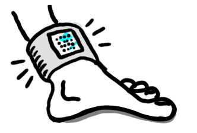
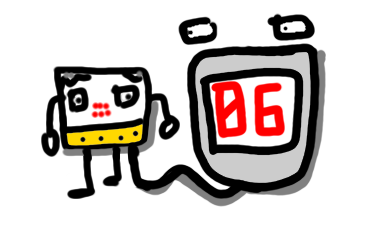
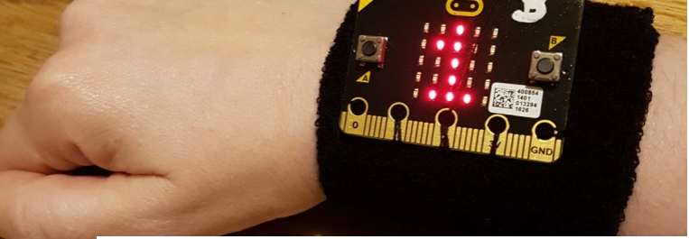
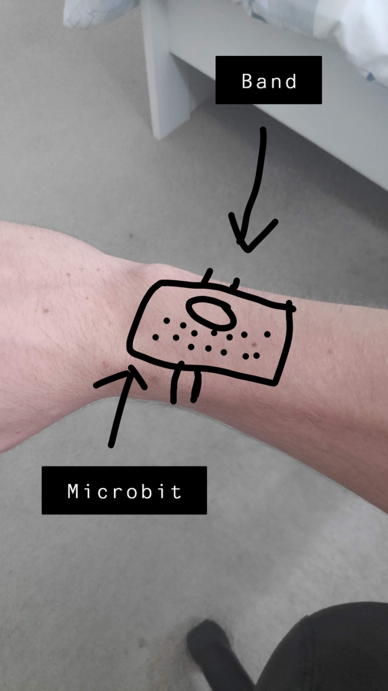

# 1701QCA Making Interaction - Assessment 2 workbook
You will use this workbook to keep track of your progress through the course and also as a process journal to document the making of your projects. 

## Backflip Counter ##

## Related projects ##
*Find about 6 related projects to the project you choose. A project might be related through function, technology, materials, fabrication, concept, or code. Don't forget to place an image of the related project in the appropriate folder and insert the filename in the appropriate places below. Copy the markdown block of code below for each project you are showing.*

### Related project 1 ###
Micro bit Step Counter
https://makecode.microbit.org/projects/step-counter 

This project is related to mine because lots of the coding is the same. However instead of an element been on each ‘step’ it is on each ‘rotation’ to add a counter on the micro bit.  About half of my coding stems from this project. 

### Related project 2 ###
Basketball score counter
https://www.dfrobot.com/blog-1008.html

This project is related to mine because it is also a score counter, but for every time the ball is shot into the basketball hoop. For their invention, they had a unique idea and used extra equipment such as DuPont cables, digital mobile speaker, and a micro mate. Using these sensors allowed DFRobot to create an innovative project.

### Related project 3 ###
Micro bit Counter

https://www.instructables.com/id/How-to-Make-a-Counter-With-Microbit/
No Image available

This project demonstrated to me the fundamentals of creating a counter. This tutorial shows what materials you will need to make the project and the programming steps used to set it up. The counter used in this tutorial is a counter of how many times the button is pressed. When the button ‘A’ and ‘B’ are pressed together the counter resets. Since my counter was sensor based with the rotation of the micro bit, I created my project so that it resets with just one button press. 

### Related project 4 ###
Mircobit Stop Watch
https://makecode.microbit.org/projects/stopwatch

This project is related to mine because it has the same reset function. This project instead of counting flips counts the seconds that go by after the button is pressed. The code of this project looks similar to mine as it contains a few of the same elements.

### Related project 5 ###
Step Counter with rewards 

*Insert URL to project*

This project is related to mine because it tracks how many steps the user does. The design of this project as a ‘wearable device’ gave me inspiration on what I could do for my final project to make it a more permanent, wearable design. 

### Related project 6 ###
Micro bit Wear: IT
https://www.edtechs.com.au/product_p/mbit-wearit.htm

This project is gave me inspiration towards my design process as it shows how I could make the device wearable. Currently I do not have the materials and this is my first prototype, but for the final design I plan to have it so that the device is wearable. 

## Other research ##
YouTube Video
https://www.youtube.com/watch?v=sjNTQQ34LmE
I used this video to see how someone else went about making their micro bit wearable. It gave me idea about what I should do for my final design and how I’d attach it to the body. 

## Conceptual progress ##
I have thought lots about what would be the best and most effective way to make a micro bit flip counter.  I did lots of experimenting and came up that the rotation axis is the variable which is most effective in changing. I conceptually under the concept and the code very well, as when making the code, I played around which each individual element to see what it did. 

### Design intent ###
Wearable device that counts the amount of backflips you do

### Design concept 1 ###

For my first design idea, I thought about attaching it your thigh and then having some sort of band that wrapped around. I thought that that would be a good idea at first, but then thought of the user experience in trying to wrap a small micro bit around their thigh and thought it might be a bit difficult. 

### Design concept 2 ###

For the second design concept idea, I thought about putting the device around the ankle, and sewing the micro bit into a sock or a wearable device. This is a great idea, however it could interfere with the flexibility of your ankle while you are jumping. 

### Final design concept ###

For the final design concept, I thought about having a strap or a band, so that it was like wearing a watch. This would interfere the least with the actual backflip and will most likely be the most comfortable for the user. I thought about either using an old sock or sewing it into it. The interaction for the user would be the most easy and familiar, as people have most likely worn watches before. The materials to be used would be cotton. I am also thinking about a strap like a watch, but I don’t know how I’d attach it to the micro bit. While writing this I came up with a final idea. I could glue the micro bit down to a piece of strong cardboard, and then make holes which can fit rubber band in. These rubber bands you would be able to squeeze over your arm to make it tight.    

### Interaction flowchart ###
The interaction of this device is very user friendly and only needs a few instructions. Person puts the wearable device on > press ‘A’ to reset or > resume current score> do flips to make the score higher. 

Unwanted actions could be if people do a handstand instead of a flip, or if they spin their arms around in circles to simulate the flips. This would be cheating, and what the fun in cheating? 

## Physical experimentation documentation ##
Code of project.

Fabrication. The initial materials I was going to use was cotton, and to sew it onto a sock. However, I changed my mind when I realised I didn’t have any old socks I wanted to cut apart, and I also didn’t know how to sew. I thought about gluing the micro bit to a little bit of cardboard, or double sided taping it. Then having holes on this board which rubber bands would be able to attach onto, and onto your arms.  

Design Concept Video. 
https://www.youtube.com/watch?v=Anxr-vdkpsc
This video shows that as the device is rotated upside down, the score goes up by 1. 

## Design process discussion ##
The design process I formed, based particularly on the double diamond design strategy was that the main problems of design one and two were that they were not the most user friendly. Possible solutions that I came up with that could work were putting the micro bit onto your wrist. 

## Next steps ##
The next steps for the future of my project are to make the device wearable. I’ll test out my idea with the cardboard, and make changes to that to get it working and make variations to get the best user experience possible. 
